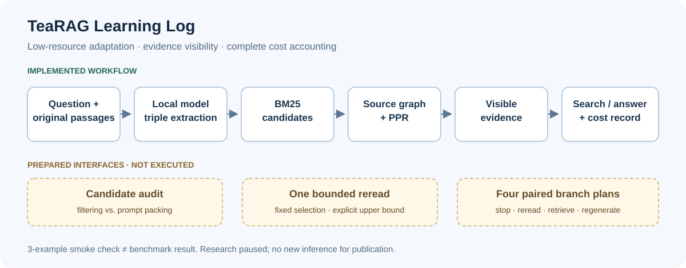

# TeaRAG Learning Log

A learning record of agentic retrieval, evidence filtering, and stopping decisions.

**This notebook documents a low-resource TeaRAG workflow adaptation, what it taught me, and the questions still open.** The research work is paused; this publication organizes the existing progress.

English | [中文](README_ZH.md)

[Learning notes](notes/2026-09-30-learning-log.md) · [Scope and limitations](notes/reproduction-boundaries.md) · [Recorded summary](results/smoke-summary.json)

*Workflow overview. The diagnostic branches are prepared interfaces and have not been executed.*

## Progress as of September 30, 2026

| Area | Recorded progress |
|---|---|
| Data | HotpotQA: 30 training smoke examples; 150 calibration and 350 holdout examples; inputs and scoring references separated |
| Retrieval workflow | Local model triple extraction, BM25 retrieval, source-linked graph and Personalized PageRank filtering |
| Agent loop | Structured search/answer actions, a five-retrieval limit, and an answer opportunity after the final retrieval |
| Observability | Pre/post-filter candidates, visible evidence, source IDs, responses, tokens, latency, and termination reasons |
| Diagnostics | Initial offline auditing, fixed-budget reread preparation, and four paired branch plans |

The original TeaRAG source is pinned to [`802e859`](https://github.com/Applied-Machine-Learning-Lab/TeaRAG/commit/802e859950425390156fee8251c1ae0dcc6e0df4). The local adaptation uses Python 3.9 and an existing Llama 3 8B Q4_0 model. It does not use TeaRAG's trained checkpoint or reproduce its training procedure.

## What I learned

- Retrieved candidates, PPR-selected candidates, and evidence actually visible to the model are three different objects. A filtering diagnosis must keep them separate.
- A discarded passage can share a source with a retained triple. Source overlap does not establish that every relevant fact survived.
- Cost accounting must include triple extraction and all answer-generation calls. In this experiment the graph was rebuilt per question, so those costs cannot be treated as amortized deployment costs.
- A strict answer mismatch can reflect wording rather than a different entity. Conversely, an incorrect one-round answer alone does not establish premature stopping.

## One small recorded run

This run finished before the research pause. It used the first three training examples for workflow checking.

| Measure | Recorded value |
|---|---:|
| Completed examples | 3 / 3 |
| Exact match | 1 / 3 |
| Mean answer token F1 | 0.8222 |
| Mean retrievals | 1 |
| Input + output tokens | 9,167 |
| Triple-extraction tokens | 7,700 |
| Online planning/answer tokens | 1,467 |
| Total elapsed time | 124.98 seconds |

**Three nonrandom smoke examples demonstrate an executable workflow. They do not establish benchmark performance, a successful official reproduction, or an effective new stopping policy.** No new question inference was run for this publication.

## Validation and remaining work

The basic implementation's last recorded full test run passed 28 tests. The new audit, reread, and branch modules separately passed 9, 7, and 10 synthetic tests; these counts are not a final integrated test result.

One audit issue remains: omission and truncation IDs can be inconsistent with the evidence provenance or actual shortening. The next implementation step is to add negative cases and fix that validation, then independently review the branch changes and run synthetic integration checks.

The planned mechanism study compares accepting the existing stop, rereading one discarded passage, retrieving once more within the common limit, and regenerating with unchanged evidence. Actual paired executions and any calibrated selective policy remain future work.

## Reading path and sources

1. Read the [Chinese learning notes](notes/2026-09-30-learning-log.md) for the reasoning and examples.
2. Read [reproduction boundaries](notes/reproduction-boundaries.md) for the adaptations and unresolved claims.
3. Inspect the [sanitized run summary](results/smoke-summary.json) for the recorded numerical results.

Primary sources: [TeaRAG paper](https://arxiv.org/html/2511.05385v2), [TeaRAG repository](https://github.com/Applied-Machine-Learning-Lab/TeaRAG), [HotpotQA](https://hotpotqa.github.io/), and the [official answer evaluator](https://github.com/hotpotqa/hotpot/blob/master/hotpot_evaluate_v1.py).

Organized on October 1, 2026. Maintained by [cloudwallker](https://github.com/cloudwallker).
